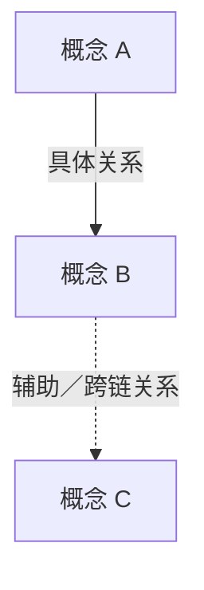

# 输出契约

## A. 严格命题清单

```markdown
---
title: {标题}｜严格概念图命题清单
tags: [概念图, 命题清单, 审计]
source: "[[{源笔记}]]"
---

# 焦点问题
> {一个能统领全图的问题}

# 重要节点
- {概念}

# 次要节点
- {概念}

# 外部／证据节点
- {证据概念}

# 可朗读命题
1. {概念 A} → {关系短语} → {概念 B}。

# 概念笔记下钻
- [[已有概念笔记]]

> [!note] 边界
> {哪些信息不进入主图、保留在哪里}
```

## B. 中密度 Mermaid 主图

```markdown
---
title: {标题}｜中密度推荐版概念图
tags: [概念图, Mermaid, 中密度, 推荐版]
source: "[[{源笔记}]]"
---

# {用问题或核心结论命名}

> [!question] 焦点问题
> {焦点问题}



## 概念笔记下钻
- [[已有概念笔记]]

> [!note] 图外解压缩
> {从主图移出的案例、数据和解释仍保留在哪里，以及主图保留了它们证明的什么机制}
```

## 质量计数

- 节点数按 Mermaid 中不同 node ID 计算，同一节点多次出现在边中只计一次。
- 命题数按有语义标签的边计算；纯布局边不得混入语义计数。
- 证据节点必须指向它支持、反驳或界定的概念，不能漂浮。
- 高密度不是“所有细节都放进图”；所有信息由“命题清单 + 主图 + 概念笔记／原文”三层共同保留。
- 中密度主图默认控制为接近横向阅读页的比例：宽高比优先 `1.6–2.0`，不应超过 `2.2`。比例只是一项报警线，最终仍以节点可读、路径连续和无严重交叉为准。
- Mermaid Markdown 是正式交付物；PNG 只是可选预览。缺少渲染器时不得安装 Chromium 或阻塞任务，应直接交付可复制、可在支持 Mermaid 的平台显示的代码块。
- 图片导出优先级为 `SVG > 4× PNG > 2× PNG > 1×截图`。SVG 用于长期保存和任意缩放；约 40 节点的 PNG 正式稿通常接近或超过 5000 像素宽。
- 图片渲染采用三级回退：已有浏览器则本地渲染；无浏览器且内容非敏感则使用 Kroki POST；敏感内容或无网络则只交付 Mermaid。远程回退不得成为上传敏感信息的理由。
- 透明背景不等于必须改成 JPG。概念图优先使用白底 PNG 或白底 SVG；JPG 的有损压缩会降低小字与细线质量。
